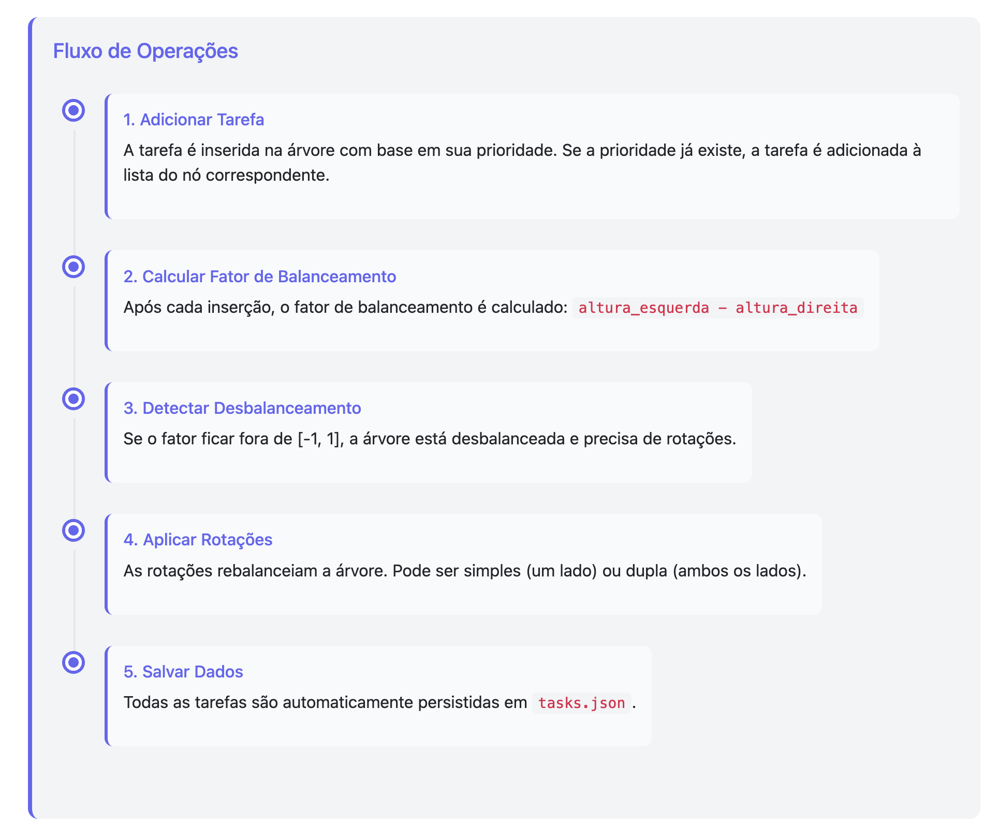
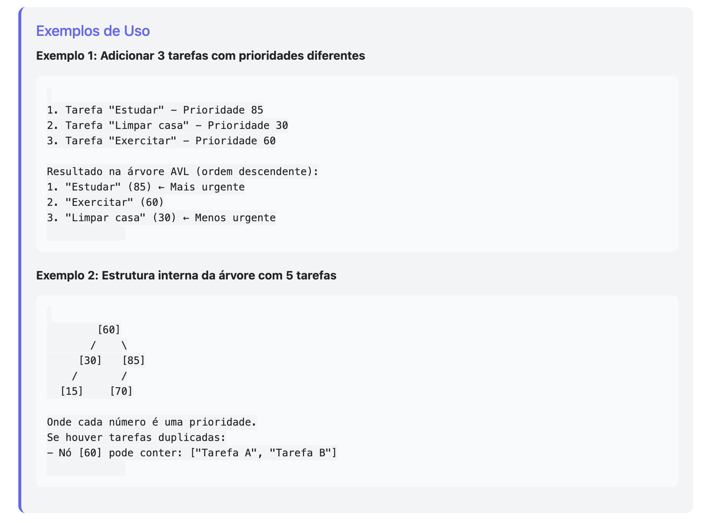
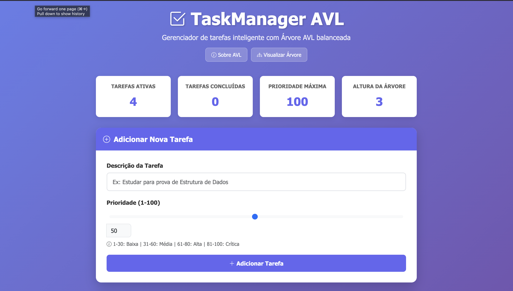
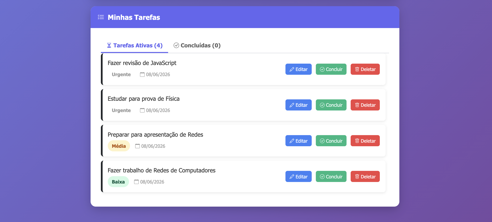
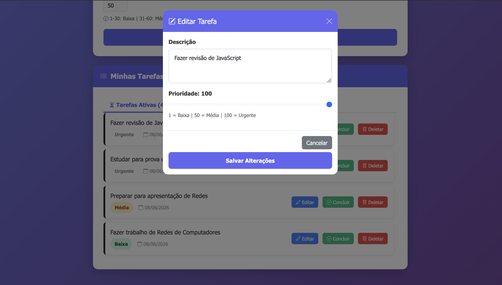
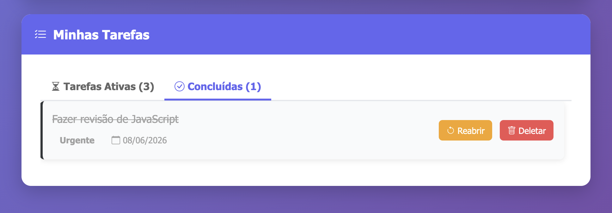
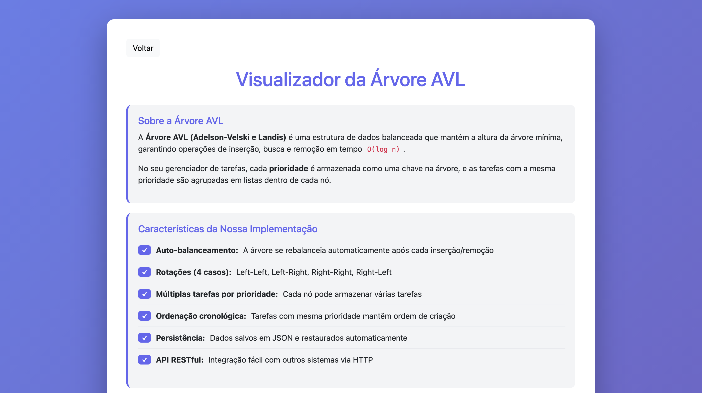
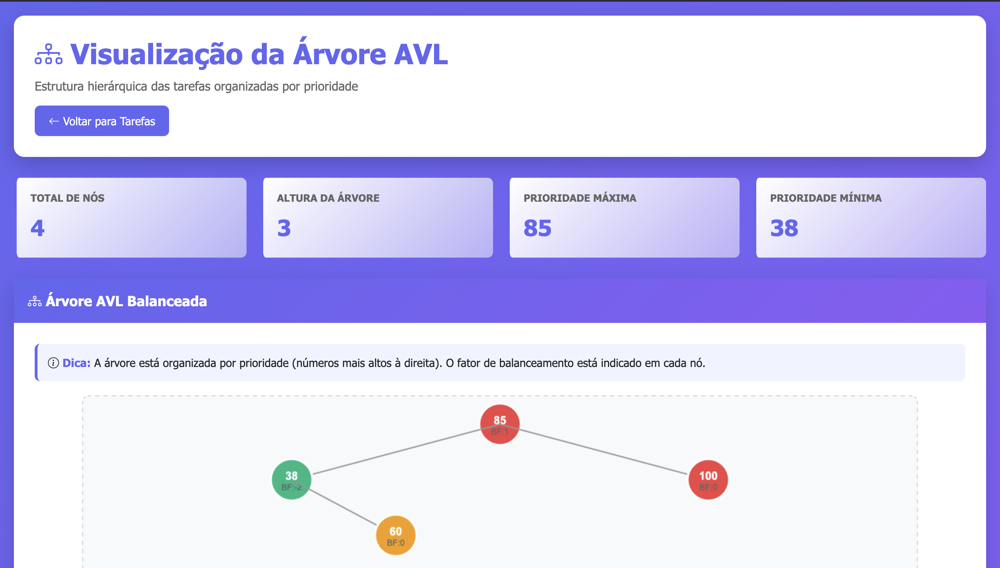

# G3_Arvore_EDA2-2026.1


## Grupo 3
|Matrícula | Aluno |
| -- | -- |
| 22/1022720  | Rayene Ferreira Almeida |
| 20/2017361  | Enzo Fernandes Borges   |

## Sobre 
Este programa é um **gerenciador de tarefas prioritárias (To-Do List)** que utiliza uma **Árvore AVL** para organizar suas pendências. 

Ele funciona da seguinte forma:
1. Cada tarefa cadastrada tem uma prioridade (de 1 a 100).
2. O motor do programa (a Árvore AVL) mantém as tarefas sempre ordenadas e balanceadas automaticamente no background.
3. Isso garante que operações como **inserir tarefas**, **concluir/remover itens** e **buscar a tarefa mais urgente** ocorram instantaneamente (em tempo logarítmico).
4. O programa também salva e recupera as tarefas automaticamente em um arquivo `tasks.json` para que você não perca seu progresso ao fechá-lo.

## Funcionalidades:
As principais funcionalidades do programa são:

* **Inserir Tarefa com Prioridade:** Adiciona tarefas contendo descrição e nível de urgência (1 a 100).
* **Agrupar Prioridades Iguais:** Permite registrar várias tarefas com a mesma prioridade (elas se organizam cronologicamente por ordem de chegada).
* **Remover/Concluir Tarefas:** Exclui tarefas específicas do sistema de forma rápida.
* **Auto-balanceamento (AVL):** Executa rotações de forma transparente após inserções/deleções para manter o tempo de resposta sempre rápido.
* **Buscar Tarefas Mais/Menos Urgentes:** Encontra diretamente o item de maior ou menor prioridade sem varrer o restante da árvore.
* **Listagem Ordenada:** Retorna e exibe a lista completa de pendências ordenada de forma crescente ou decrescente.
* **Salvar e Carregar Automático:** Salva todo o progresso em um arquivo `tasks.json` e o reconstrói fielmente ao iniciar o programa.

## Fluxo de Operações

<div align="center">
  
  <br>
  <em></em>
</div>

<br>

## Exemplo de uso

<div align="center">
  
  <br>
  <em>Exemplo de uso</em>
</div>

<br>

## Acesso 
### Máquina local

1. Instale as dependências do projeto:

```bash
pip install -r requirements.txt
```

2. Execute a aplicação:

```bash

python app.py
```

### Online pelo vercel

Acesse o link [https://arvore-ten.vercel.app/](https://arvore-ten.vercel.app/)


## Screenshots


<div align="center">
  
  <br>
  <em>Tela inicial do sistema</em>
</div>

<br>

<div align="center">
  
  <br>
  <em>Tela de tarefas</em>
</div>

<br>

<div align="center">
  
  <br>
  <em>Card de edição de Tarefa</em>
</div>

<br>

<div align="center">
  
  <br>
  <em>Tarefas Concluídas</em>
</div>

<br>

<div align="center">
  
  <br>
  <em>Informações de Árvore AVL</em>
</div>

<br>

<div align="center">
  
  <br>
  <em>Visualização da Árvore AVL formada</em>
</div>

<br>

## Video

<div align="center">
  <a href="https://youtu.be/Uf5XsuNofQ8">
    
  </a>
</div>

<p align="center">
  <b>Autores:</b>
  <a href="https://github.com/rayenealmeida">Rayene Almeida</a> e 
  <a href="https://github.com/enzo-fb">Enzo Fernandes</a>
</p>
